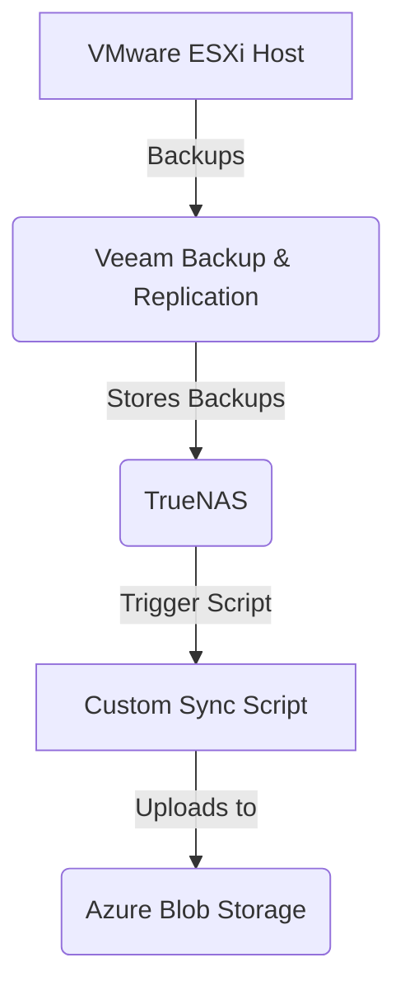

# VMProtect - 🚀 VMware ESXi Backup Infrastructure

## 📌 Overview
This document describes the **VMware ESXi backup setup** running on a **Dell OptiPlex** with the following specifications:

| Component                | Details                  |
|--------------------------|--------------------------|
| **Host**                | Dell OptiPlex           |
| **Storage**             | 512GB SSD               |
| **Memory**              | 16GB RAM                |
| **Virtualized Environment** | VMware ESXi        |
| **Backup Software**     | Veeam Backup & Replication |
| **Backup Destinations** | TrueNAS, Azure Blob Storage |

---

## 🔄 Backup Workflow

1. **Veeam Backup & Replication** runs on **Windows Server VM**.
2. Windows Server stores backups directly on **TrueNAS**.
3. **A custom script**, executed by Veeam after the backup completes, syncs data to **Azure Blob Storage**.
4. **Backups are scheduled to run weekly.**

---

## 🛡️ Disaster Recovery Considerations
✅ **Local Redundancy:** TrueNAS ensures backup safety with secondary storage.  
✅ **Off-Site Backup:** Azure Blob Storage adds an additional security layer against failures.  

---

## 🔐 Security Measures
✔ **Backup Encryption:** Configured where applicable.  
✔ **Access Control:** Restricted admin access to backup servers.  
✔ **Firewall Protection:** Inbound access limited to essential services.  

---

## 📊 Monitoring & Alerts
⚠ **Veeam Alerts:** Configured for backup job failures.  
📡 **TrueNAS Monitoring:** SMART monitoring for disk health and storage performance.  

---

## 📈 Future Improvements
💾 Expand storage capacity for long-term retention.  
📡 Implement **Zabbix** for advanced monitoring and alerting.  

---
**Last Updated:** 31.03.2025
